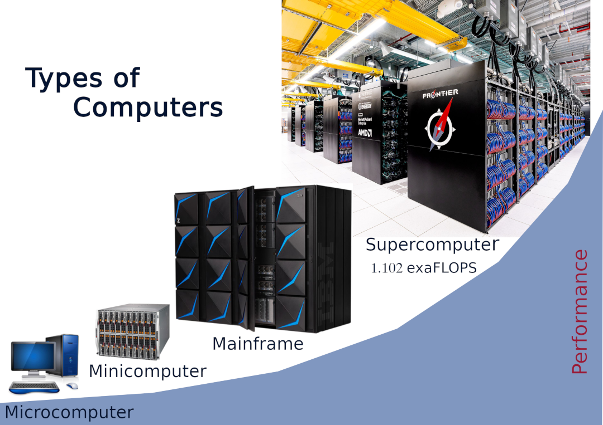
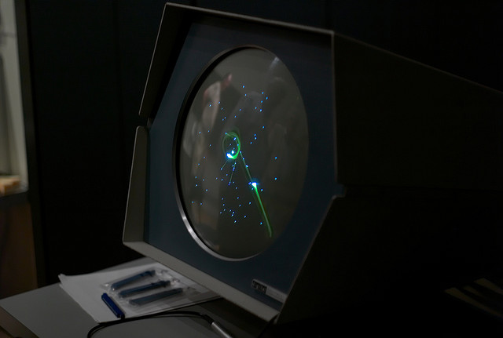

+ What is hardware? What is software?
+ What are "minimum hardware requirements" and how do I tell if my computer meets them?
+ Why should I update my OS/Chrome/other software?
+ Where is my data stored? Is it backed up? How can I tell?
+ Where is the file I just downloaded? Can I download files to different places?
+ How do I install software? (I have a lot of mac users clicking on the dmg file every time)
+ What are file extensions? How can I link them to specific software programs?
- How do I navigate the file structure using my OS's GUI? i.e., how to use Finder/File Explorer. How do I move and organize files? How do I create folders? etc.
- How can OneDrive be used for collaboration?
+ How can I keep track of all my passwords?
+ How can I use Google effectively to help troubleshoot computer problems? (also required: actually reading error messages)
- And perhaps some basic task to get them thinking about problem solving, like using a spreadsheet to calculate their weighted average or a mail merge or something
Collapse

### feedback 2024 

#### wsl - how to setup linux account account to be the same as windows

- Putting your WSL2 home directory on a Windows drive is not recommended because:
    - Your Linux home directory should be on a POSIX-compliant drive. 
    - Accessing Windows drives from WSL2 is extremely slow compared to the virtual ext4 filesystem. 
Add screen shots:

#### Accessing Linux files from Windows. 
This is NOT recommended, editing Linux files in Windows will corrupt them.
You can type explorer.exe in the WSL terminal. This will oen files explorer in the current WSL directory 
You can use VSCode with Remote - WSL extension 

#### Accessing Windows files from Linux
/mnc/c/Users/...

### Glossary
- ASCII
    - *American Standard Code for Information Interchange*; the most common 7-bit character encoding table. 
- Bit
    - The smallest unit of data that can hold one of two values: 0 or 1.
- Boot loader
    - A computer program that is responsible for booting a computer. Its main function is to place the operating system into memory.
- Byte
    - The unit of digital information that typically contain eight bits.
- CUDA
    - *Compute Unified Device Architecture*; a platform and programming model for general-purpose computing on graphics processors developed by NVIDIA.
- Device Driver   
    - A software program that controls a specific hardware device attached to a computer. By using drivers, operating systems and other computer programs can control hardware devices without knowing their specific details.
- Distribution
    - complete operating system that includes the kernel, system libraries, utilities application software, and a package management system.
- GUI  
    - *Graphical User Interface*; an interface that utilizes visual elements such as icons, buttons, or menus to interact with users.
- HDD
    - *Hard Disk Drive*; data storage device storing data on spinning magnetic disks.
- IOPS
    - *Input/output Operatons Per Second*; unit of measurement showing how many read/write operations a storage device can perform per second.
- Kernel
    - the core component of an operating system that interacts closest with hardware and manages all processes. 
- Operating system  
    - A collection of programs that serve as the interface between computer hardware and you. The operating system controls the computer's tasks and manages system resources.
- Package 
    - a collection of executable programs, libraries, and data, along with instructions for istalling and configuring the software.
- Package manager 
    - software installed in the operating system that downloads, installs, and maintains various software packages you choose to install as well as all other packages.
- Permissions
    - File system attiributes that specify who can read, write, and execute a file or directorty. 
- Platform
    - Data environment that allows a software to run.
- RAM   
    - *Random Accsess Memory*;  short-term memory. As the computer operates, the information stored in RAM memory changes. Turning off the computer erases RAM memory.
- Stream Multiprocessor
    - individual processing unit within a GPU responsible for executing tasks in parallel. 
- Server
    - computer that can be accessed remotely over a network to provide resources and services to another computers (clients)
- Shell  
    - A command-line interface to a Unix-like operating system. It works as an interpreter by accepting user input, executing a command based on it, and displaying its output after the command has completed.
- SSD
    - *Solid-State Drive*; data storage device storing data in electronic semiconductor-based  memory cells.
- Windows Manager 
    - A system software which handles how windows created by various applications share the screen and which application gets user input at a given time.
- WSL
    - *Windows Subsystem for Linux* Windows feature allowing you to run a Linux environment on your Windows machine   

---
Web Pages:
https://ssvassiliev.github.io/Basics_of_Computers/

Slides:
https://docs.google.com/presentation/d/1WuTsmnyvrDvQ_L_HpEgaFE5C235lWtG_e1chkc3YMHY/

?. The first exascale supercomputer Frontier was built with what type of CPUs? Here's a hint: the answer is on the slide. 
    1. Intel Xeon
    2. AMD Epyc
    3. IBM Power
    4. Apple M2

1. What components are required for a computer to function?
    1. Hardware, device drivers, operating system
    2. Operating system, application software, hardware
    3. Hardware, application software
    4. Boot loader, operating system, application software, CPU

2. What numeric code would you use if you wanted the permission to be
'rwx -w- r-x'? 
    1. 764
    2. 725
    3. 735
    4. 825

3. How many charge levels are used in a triple level flash memory cell? 
    1. 3
    2. 6
    3. 8

## 2. What is ACENET?
If you haven’t heard of ACENET before, we are a non-profit organization funded by government and member institutions, with a mandate to support researchers at Canadian academic institutions and industry in their use of advanced digital tools and technologies, especially the national digital research infrastructure in Canada. 

We provide access to HPC clusters and cloud computing. Our local support team can help you get started and get the most out of the avilable systems.

Training is a big part of our work. We are offering a variety of workshops, most with a live coding component.

## 3. Objectives
This lesson is intended to lead you through some basic computer concepts that will give you a better understanding of the computer. We will learn what is inside a computer and how it works, how to use and maintain a computer, and how to handle possible issues.

## 4. What is a computer?
In its original sense, the term "computer" referred to someone who performed mathematical calculations. In doing their jobs, human computers were supposed to follow fixed rules and they had no authority to alter them. The term was later applied to mechanical devices that replaced human computers.

Today a computer is a programmable device that  
- accepts data as input
- processes that data with a set of instructions (a program) 
- produces results as output
- stores the results for future use

## 5. What are the different types of computers? 
There are different types of computers:
- supercomputers
- mainframes
- minicomputers (servers, don't confuse with mini-PCs)
- microcomputers

### Supercomputers
Supercomputers are unique facilities, providing exceptional computing power. The term is used to describe the fastest high-performance systems available at any given time. Computers of this type are primarily used for scientific and engineering work requiring extremely fast computations.

Currently the most powerful supercomputer is Frontier. The Frontier has achieved a performance of 1.102 exaFLOPS. One exaFLOP is a quintillion (1018) double precision floating point operations per second.

### Mainframes
Mainframes are a type of computers that generally are known for their large size, amount of storage, processing power and high level of reliability. Mainframes first appeared in the early 40s. Companies and governments use mainframes as central computers to carry out their day-to-day operations. Mainframes are primarily used for mission-critical applications requiring high volumes of data processing such as census, industry and consumer statistics, and enterprise resource planning. Most mainframes are built by IBM.

### Minicomputers (Midrange Servers)
Computers called minicomputers have many of the features and capabilities of mainframe computers, but are smaller. DEC introduced mini computers in 1965 as a smaller and inexpensive alternative to mainframes. The PDP-1 (Programmed Data Processor) was the first mini computer. It is famous for being the computer most important in the creation of hacker culture. And history's first space shooter game Spacewar! featuring orbital mechanics around a gravitational star.

https://www.youtube.com/watch?v=1EWQYAfuMYw

In recent years mini computers evolved into a midrange computers or midrange servers running business and scientific applications. Midrange computer is a loosely defined term for a computer system that is more powerful than a general-purpose personal computer but less powerful than a full-size mainframe computer.

### Microcomputers
A microcomputer is a small, personal computer that is typically used by only one person at a time. 

### Poll #1
1. The first exascale supercomputer Frontier was built with what type of CPUs? (Hint: the answer is on the slide "Types of computes")
    1. Intel Xeon
    2. AMD Epyc +
    3. IBM Power
    4. Apple M2

## 6. What’s Needed for a Computer to Function? 
There are three components that every computer needs to function, regardless of its type:

1. Hardware
2. Operating system (it includes system software + device drivers)
3. Application software

### Computer Hardware 
Hardware is stuff you can touch as opposed to the software which is abstract and exists in a virtual world of computer code. Hardware is made of materials mostly metals and semiconductors. It includes various components that are required for a computer to run.

### Computer Software
Software, in its most general sense, is a set of instructions or programs instructing a computer to do specific tasks. All computer programs such as executable files, libraries, and scripts can be defined as software. Software is stored in computer memory and can not be physically touched.

Software consists of instructions that upon execution instruct hardware to perform tasks for which it was designed. At its lowest level an executable program is composed of machine language instructions specific to a particular processor. 

A machine language consists of groups of binary values describing processor instructions that change the state of the computer from its preceding state. For example an instruction may change the value stored at the particular memory location inside the computer. This effect is not directly observable by the user. An instruction may also cause something appear on the display of the computer system. Such state change is visible for the user. The processor carries out instructions in the order they are provided unless it is instructed to jump to a different instruction or interrupted. 

There are two types of software: system software, also known as an operating system, and application software.

### Operating System
Operating system is designed to operate the computer hardware, to provide basic functionality and to provide a platform for running application software. Operating system is an essential collection of computer programs that manages resources and provides common services for other software. Operating systems are composed of system software and device drivers. Boot loaders, command line shells, device drivers and windows managers are core parts of operating systems. 

Device drivers are programs that controls a particular type of device that is attached to a computer. Each  device needs a corresponding device driver. Thus a computer needs multiple device drivers. Also, operating systems come with software designed to assist users in maintaining and caring for their computers. This software is referred to as utilities.

An operating system can be compared to the driver of a car. The driver might appear as if all he is doing is instructing the car where to go. However, in fact he is bringing in a variety of information from different parts of a vehicle. He is also taking in any information that is given to him, like a map, instructions for where to travel, and road signs that he encounters along the way. An operating system within a computer interacts with a variety of components inside it in the same way that a driver interacts with a car. An operating system acts as a middle man between users and the computer by creating an environment that allows them to interact with the computer as efficiently as possible.

### Application software and computing platforms
Application software uses the computer system to perform useful work or provide entertainment functions beyond the basic operation of the computer itself.

In order for a piece of application software to run, it requires an appropriate environment which is known as a platform. Platforms can refer to a variety of things depending on the context. The term platform may refer to hardware or to an operating system. A platform can also be a Web browser or other underlying application software such as the Java or QuickTime, for example. Computing platforms can be thought of as the stage on which computer programs can run.

As an example, operating systems run on hardware, so when it comes to operating systems, hardware is a platform. In the case of Office or Photoshop, they are both programs that run on an operating system. This means that their platform consists of the operating system and the underlying hardware combined. As a final example, Java applications only need the Java runtime environment to operate, which means they can be run on any computer regardless of its hardware and its operating system, as long as Java runtime is installed on it.

Despite the fact that a lot of things work across different platforms, some more involved programs, like video editing software or games, do not run well or do not work at all across all platforms.

Hardware and software require each other and neither can be used without another.

## Poll #1
2. What components are required for a computer to function?
    1. Hardware, device drivers, operating system
    2. Operating system, application software, hardware +
    3. Hardware, application software
    4. Boot loader, operating system, application software, CPU

