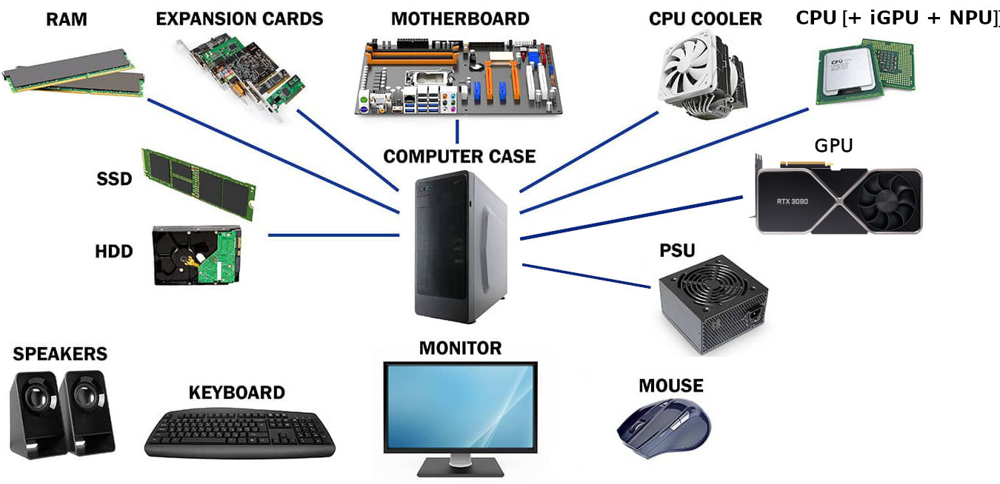
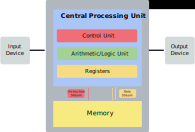
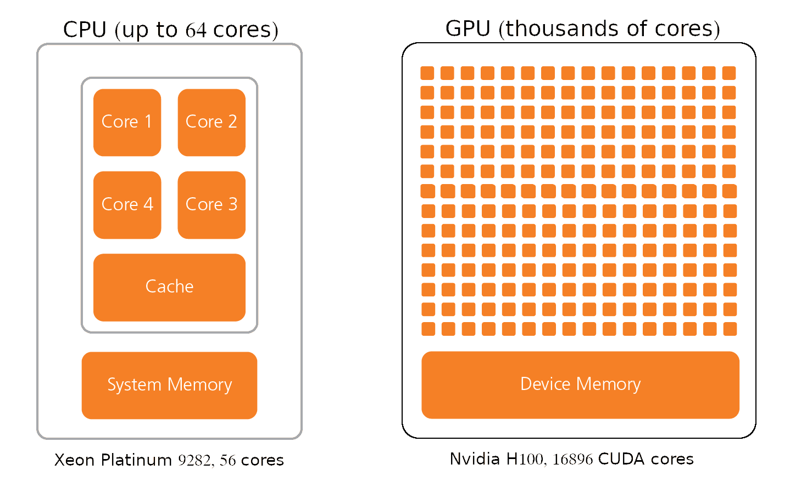

## 6. Anatomy of a computer (Basic parts of a computer).
You might be wondering what you find inside a computer when you open it up. A modern computer contains a lot of things. What exactly is inside and what are the functions of all its components? 

First I am going to take you through a quick overview of the most common hardware components. We will then take a closer look at some most important components.

1. A computer case is the enclosure that houses the internal components of the machine. The purpose of a computer case is to protect and cool the components of your computer.
2. Power supply units (PSU) convert mains AC power into regulated low-voltage DC power for computer internal components.
3. Data storage devices, like hard disks and flash drives, enable users to store all kinds of information, including videos, documents, pictures, and raw data.
4. Input/output devices allow computers to communicate with human operators and other systems. The most common input devices are keyboards, mice, joysticks, and controllers, while the most common output devices are monitors, speakers/headphones, and printers.
5. In a computer, Random Access Memory serves as its main memory. It is commonly called just memory. 
6. In any digital computer, the CPU is the brain which does nearly all the calculating. It is the main microchip in the computer that distributes tasks to all other components of the computer. Most CPUs consist of three major parts: memory, control unit, and arithmetic-logic unit. Yes, the CPU has an internal memory system called a CPU cache. The processor cache is a bank of extremely fast memory that facilitates efficient communication with main memory. 
7. A graphics processing unit (GPU) is a specialized processor originally designed to accelerate 3D graphics rendering. There are different types of GPUs: integrated GPUs that are part of the CPU and discrete GPUs that are sold separately. Compared to integrated GPUs, discrete GPUs have much greater processing capabilities. GPUs today are more programmable than ever before. In addition to traditional graphics rendering, they are now used in a wide range of applications. 
8. Last but not least, the motherboard is one of the biggest boards in a computer's case, and it forms the backbone of the device. Besides managing power, motherboard enables communication between a computer's CPU, RAM, storage and other components.

As we move forward, let's take a closer look at some of the most important computer components.

## 7. Central Processing Unit (CPU) 
A CPU is one of the main components of your computer which is responsible for processing the data. Processors are electronic circuits used by computers to execute instructions. There are three main components of any CPU: arithmetic logic unit, control unit and registers. It is a very basic example, as modern more sophisticated CPU chips have additional logic, but there are at least these three main components in all CPUs.

What are the functions of these main CPU components?
1. Arithmetic Logic Unit carries out arithmetic (addition, subtraction etc) and logic (AND, OR, NOT etc) operations.
2. Control unit 
- reads and interprets instructions from the memory.
- controls the operation of the ALU, memory and input/output devices, telling them how to respond to the program instructions.
3. Registers are high-speed storage areas in the CPU. Whenever data is processed, it must first be stored in a register.

## 8. Graphics Processing Unit (GPU)
Graphics processing units have become one of the most important types of computing technology today. GPU development had predominantly been driven by the gaming industry, and GPUs are best known for their capabilities in video rendering. GPUs were originally developed to accelerate specific 3D rendering tasks. Over time, these fixed-function engines became more programmable and more flexible. While graphics processing remains their principal function, GPUs have evolved to become more general-purpose parallel processors. Today they are handling a growing range of scientific and engineering applications in areas such as machine learning, particle and fluid simulations, drug design, and electronic structure calculations.

Although most modern CPUs are equipped with integrated GPUs, the performance of these GPUs as compared to discrete GPUs is much lower.

The main difference between CPU and GPU is that a CPU is designed to handle a wide-range of tasks quickly (as measured by CPU clock speed), but are limited in the number of tasks that can be running concurrently. The CPU focuses its small number of cores on individual tasks and on getting things done quickly. 

GPUs consist of thousands of smaller and more specialized processing units (cores). By working together, the cores deliver massive performance when a processing task can be divided up and processed across many cores. For example, when images are processed, they are divided into small blocks and each processing core works on a small part of the image.

Nvidia calls its parallel processing platform Compute Unified Device Architecture (CUDA). CUDA cores are the processing units inside an Nvidia GPU just like AMD’s Stream Processors. It might be helpful to consider an example to understand how CUDA cores help to accelerate computing. The processor can be compared to a water tank in the sense that it holds data to be processed. The job of emptying the tank will require you to use pipes. You will be able to empty the tank faster if you connect more pipes. CUDA cores act as if they are pipes connected to the processor. With a larger number of CUDA cores, processing can be done at a much faster rate due to the fact that this can be done in parallel.

CUDA cores are only a part of what Nvidia GPUs offer. Additionally, they are equipped with cores that are specially designed for ray tracing and for tensor operations.

**Nvidia H100 GPUs** up to 132 Streaming Multiprocessors, 128 FP32 CUDA cores per SM, total 16896 CUDA cores.  
**Intel® Xeon® Platinum 9282**  56 cores, 1 AVX-512 vector unit per core can process 16 FP32 numbers at a time.

In summary, GPU architecture enables to process massive amounts of data simultaneously at extremely fast speeds.

## 9. Random Access Memory (RAM) 
During the course of computing, data and instructions enter a computer through the input devices and are then stored in memory for future processing. In computers, there are two kinds of memory: primary and secondary. Random Access Memory (RAM) is the primary internal storage area of the computer for code and data that needs to be operated on quickly. It is located on the motherboard and connected directly to the CPU. Due to this, data can be read from and written to primary storage extremely quickly. Using RAM, CPUs can interact with the information held in memory quickly and efficiently. 

The RAM can be compared to your desk's working area. When it's full, you need to organize and store stuff, otherwise everything will take forever, and things will fall off. As the amount of available RAM is limited, it needs to be cleared and refilled constantly. You won't have to worry, it happens automatically on all computers. RAM is one component of the computer that determines how fast it runs.

RAM is called "volatile" memory since the information stored in it disappears when the computer is turned off.

RAM is plugged into special slots on the motherboard. There is a wide link (known as bus) from the memory to the CPU. The memory bus is part of the collection of transport buses that transfer information between parts of the PC at high speeds. Each motherboard has a fixed number of slots for RAM, most often 2 or 4 slots. It is only possible to use certain types and sizes of RAM with specific motherboards, so check the specifications of your motherboard before you purchase. 

A computer's performance will be drastically slowed down by a shortage of memory. Although modern computers have plenty of RAM, they can still run out of memory in some situations. The most obvious is simultaneously running multiple memory-intensive applications such as video editing software, searches against large databases (protein database for example). A browser with a great deal of tabs open can quickly exhaust all computer memory. You can solve this problem by installing more RAM or running fewer programs simultaneously.

A memory leak is another scenario where all RAM is consumed and performance is deteriorated. Memory leaks occur when a computer program fails to release no longer needed memory. In some cases, memory leaks don't pose a serious threat. A memory leak in a short-lived program may not be noticed and is rarely serious because modern operating systems release all the memory used by an application when it terminates. However, the system memory can be exhausted if a program runs for a long time and consumes more and more memory over time due to a memory leak. In the worst case scenario, too much memory may be allocated and the system will slow down or stop functioning properly.

For example, Windows 11's File Explorer was recently said to cause a memory leak for some users. 

In order to resolve the issue, it is best to close the offending program and allow the operating system to release its memory. In severe cases, the system may need to be rebooted to free up all RAM.

## 10. Long Term Data Storage
Computers read both data and instructions from storage to perform various tasks. Thus, for data to be processed, it must first be stored in a way that makes it accessible to the CPU. There are many different storage devices available today that are capable of storing data for an extended period of time. Storage devices such as hard drives and flash drives contain non-volatile memory which is like paper. Even though it can be destroyed or erased, if properly cared for, it can last for a very long period of time.

### How digital computers store information?
The smallest unit of storage in a digital computer is known as the bit. A bit stores just two values a 0 or 1. In computers, everything is expressed as 1's and 0's. That language of 1’s and 0’s is called binary code.

#### What is a byte?
There is too little information in a bit to be useful. Bits can be grouped into bytes to store useful information. An individual byte can store enough information to be meaningful. The term byte was historically used to describe a set of bits necessary to encode a single character of text. In computing, a byte is typically 8 bits long and can store 256 integer values between 0-255.

#### How information such as text characters is represented in a computer?
American Standard Code for Information Interchange (ASCII) was the first standard character set for computers and electronic devices developed to facilitate communication between computers of different makes and models. ASCII assigns standard numeric values to letters, numerals, punctuation marks, and other characters used in computers. The character sets used in modern computers, in HTML, and on the Internet, are all based on ASCII. In this character set a character is represented by a group of 7 bits, so these are 128 characters in total.

For example, in ASCII upper case literals A-Z are represented by decimal numbers 65-90, so A in binary is 64 + 1 = 2^6 + 2^0 = 01000001

[ASCII, hex, binary, decimal, base64 converter](https://www.rapidtables.com/convert/number/ascii-hex-bin-dec-converter.html)

## 11. Hexadecimal number system
If you worked with image editing or webpage design you are probably familiar with Hexadecimal Colors. In this color coding system intensity of each of the three primary colors (red, green and blue) is represented by two hexadecimal digits between 00 and FF to create 255 possible values, thus resulting in more than 16 million possible colors. 

The hexadecimal number system is a type of number system, that has a base value equal to 16. It is also pronounced sometimes as 'hex'. Hexadecimal numbers are represented by 16 symbols. These symbols are 0, 1, 2, 3, 4, 5, 6, 7, 8, 9, A, B, C, D, E and F.

21 (dec) = 1x16^1 + 5x16^0 = 15 (hex)

Hexadecimal number system provides convenient way of converting large binary numbers into more compact and smaller groups because 4 binary digits are represented with one hexadecimal digit.

Hex system is commonly used in Computer programming and Microprocessors. Hexadecimal number system is used to describe locations in memory for every byte. These hexadecimal numbers are also easier to read and write than binary or decimal numbers for Computer Professionals. There is wide number of advantages in data science field, artificial intelligence and machine learning.

The major disadvantage of Hexadecimal number system is that it may not be an easy to read and write for people, and also difficult to perform operations like multiplications, divisions using hexadecimal number system. 

## 12. Octal number system

A pactical example - Linux file permissions. 

Securing your data stored on a MAC or Linux system, requires understanding file permissions: how they work, and how to change them. Permissions determine who can access files and directories and how. Linux has three types of permissions: read, write, and execute. The permissions are each controlled by a single bit that can be toggled on or off (0 - no permission, 1 - permission allowed).

There are three sets of permissions applied to different groups of users.
1. The first set of permissions applies to the owner of the file. 
2. The second set of permissions applies to the user group that owns the file. 
3. The third category of permissions is known as "others" - everyone else. 

Permissions are thus described by three groups of binary triplets:

      owner              group                others 
read write execute   read write execute    read write execute
  1     1     1  (7)  1     1      0  (6)    1    0     0 (4)  

Because each binary triplet has 8 values in the range 0 - 7, it is convenient to represent it with an octal number. As a result, a three-digit octal number represents a specific file permission (for example 764). The first digit is for owner permissions, the second digit is for group permissions, and the third is for other users.

- Only one set of rwx bits are ever used. User takes precedence over group which takes precedence over other. 

## Poll #3:
What numeric code would you use if you wanted the permission to be
'rwx -w- r-x'? 
1. 764
2. 725 +
3. 735
4. 825

## 13. Storage media types and their characteristics (Storage devices).
Bits can be stored on any medium that has at least two separate states. The three main types of storage media are magnetic, optical, and semiconductor.
- In a magnetic hard drive bits are represented by tiny magnets (magnetic dipoles) with opposing orientations.
- Reflectivity is used to encode bits on an optical disk.
- In a semiconductor chip bits are stored as electric charge. An uncharged memory cell represents one, while a charged memory cell represents zero.

## 14. What is the difference between RAM and long term storage? (Flow of information in computers)
Both RAM and storage devices store bits of information. How do they differ from one another in terms of their primary function? The primary purpose of storage devices is to store data that is not being used by CPUs. This includes lond term data storage and storage of temporary files. So, storage devices serve as an addition to the computer's main memory. It is for this reason that they are often referred to as secondary memory.

It is important to understand how information flows in a computer in order to understand how primary memory differs from secondary memory. Data and programs enter the computer through input devices. A storage medium is where data is stored for future use after it has been entered or generated by an application. It is common for storage devices to be large, but they are slow to respond. Direct access to memory of storage devices would be inefficient since the CPU would need to wait for data. In order to enhance the efficiency of the system, memory is organized in such a way that access time for running processes is minimized.

This is achieved by organizing memory access in a specific manner:

1. All programs, and data are stored in secondary memory. Secondary memory can not be accessed directly by a CPU.

2. The operating system loads instructions and data into RAM in order to execute any program. RAM is smaller, faster, and can be accessed directly by the CPU. As only the ready to run processes are loaded in primary memory, the CPU can access them efficiently, which optimizes the performance of the system.

## 15. Characteristics of storage devices
### What to Consider When Buying A Data Storage Device?
The performance of storage devices is very important for many reasons, not only for the safe and convenient storage of data, but also for the efficient operation of the computer system as a whole. A computer storage device is characterized by two basic performance measures: sequential read/write speed and random input/output operations per second (IOPS). 

IOPS are very important in making a computer feel fast and responsive, since an operating system reads and writes a lot of small files, including configuration settings, logs, and temporary data.

The speed of sequential reads and writes is more important for large file transfers.

## 16. Types of storage devices.
Solid state drives and Hard drive disks  are two types of secondary storage devices that are widely used today.
### Hard Drive Disks (HDD).
HDD are mechanical drives where data is written on a spinning magnetic disk. They are inexpensive and good for long term data storage. However, performance of HDD (particularly IOPS) is limited by the access time (the time it takes before the drive can actually transfer data). In an HDD, data transfer is sequential. Two factors that control this time are related to the mechanical nature of the rotating disks and moving heads. The seek time measures the time it takes the head assembly to travel to the track of the disk where the data will be read or written. Rotational latency is the delay waiting for the rotation of the disk to bring the required disk sector under the head. 

To summarize: the physical read/write head "seeks" an appropriate point in the hard drive to execute the requested read or write operation. This seek time can be significant. 

Thus HDDs are good for data storage, because of the low price per GB, but not so good for system disks because of the low IOPS. 

### Solid State Drives (SSD). 
Solid state drives use semiconductor media known as flash memory. One of the characteristics of flash memory that sets it apart from other storage media is that it can only be erased in large blocks at a time. The term flash was coined by one of the inventors because the process of erasing all the data from a semiconductor chip reminded him of the flash that comes on a camera when it takes pictures.

Flash memory has become a popular storage medium. In fact, flash memory has mostly replaced the magnetic hard drive disks (HDDs) that used to be common in computers. 

What makes flash memory so great is that: 
- it's is solid state, meaning that it doesn't have any moving parts. 
- flash memory is also very fast because it does not have delays in data access characteristic to mechanical drives. There is consistent read/write performance because data location is irrelevant. Speedup of accessing random small files is dramatic.

A flash memory cell can be thought of as a tiny battery. If not recharged, it will gradually lose its charge and data will be lost. It is necessary to fully discharge the memory cell before it can be used to write new data to it. Each time the memory cell is erased, it becomes more leaky, and, as a result, data retention degrades. The endurance standard requires that flash blocks cycled to 10% of the maximum specified endurance must retain data for 10 years. Blocks cycled to 100% of the maximum endurance must retain data only for 1 year. 

Although SSD prices are gradually dropping, they are still more expensive than HDDs. A good HDD sale price is 20-24$/1TB while 1 TB of SSD storage will cost you 60-100$.

## 17. Flash memory 101 - what you need to know.
For you to make an informed choice when selecting the right storage device, you need to have an understanding of the existing technologies in this rapidly evolving field. How these underlying technologies impact system performance and data storage reliability? 

When you are searching for an SSD, there are a lot of terms that you will come across, and you may feel overwhelmed by the options that are available to you.

It is likely that you will come across terms like SLC, MLC, TLC, SATA III, NVMe, and M.2. What does it all mean? Let’s take a look!

### What is NVMe?
Flash memory is so fast that (600 MB/s) SATA interface used by mechanical drives was not able to keep up with its requirements of data transfer speed. New interface known as non-volatile memory express (NVMe) has been developed to address this bottleneck. Because it was designed from the ground up specifically for flash memory it offers many advantages over SATA. The intention was to introduce a particular interfacing protocol that will efficiently work with SSDs. For this reason NVMe is rapidly becoming the industry standard for servers operating in data centers, as well as desktops, laptops, and even gaming consoles of the next generation.  

M.2 drives, unlike regular HDDs and SSDs, are not attached to a motherboard via a cable; instead, they are inserted directly into the motherboard via a dedicated M.2 connector port to PCI express bus. Currently NVMe interface can use up to 4 PCIe lanes for theoretical maximum transfer rate of 8 GB/s over PCIe gen 4. With PCIe generation 5, which is already available on some high end motherboards, transfer speed is doubled. 

NVMe M.2 Internal SSDs
- use 4 PCIe lanes (PCIe gen 4 transfers 2 GB/sec per lane)
- communicate directly with the CPU.
- enclosures for external usage of NVMe M.2 SSDs are available.
- USB3.2, USB4, and Thunderbolt3 protocols allow (10-40 Gbit/sec) transfer rates. 

### What are SLC, MLC, TLC, QLC and PLC?
Previously we saw that a medium that has two states can store one bit of information at one location. A medium must have more than two states in order to be able to store more than one bit at one location. A group of two bits, for example, would require four different states to represent all possible combinations of 0's and 1's.   

Flash memory can store more than one bit in a single cell. For example in SSD with single-level cell (SLC) technology, each cell can exist in either one of two states, storing one bit of information. The multi-level cell (MLC) is capable of storing more information than a single bit. The term MLC is often used to refer specifically to a two-level cell. Two-level cells store 2 bits of information by using 4 (2 in the power 2) charge levels. As of now, there are also flash technologies with triple and quad level cells (TLCs and QLCs). Penta-level cells are under development (working prototypes have already been demonstrated by Solidigm). 

Memory that uses multi-level cells has a higher density of information stored, so the price per gigabyte is lower when compared to memory that uses single level cells. Multilevel cell technologies enable high capacity SSDs to be manufactured. While MLC memory has the advantage of being less expensive than SLC, it is slower, has higher power consumption, higher error rate and its lifespan is shorter. This is why high-performance memory cards still use SLC flash technology.

## Poll #4.
3. How many charge levels are used in a triple level flash memory cell? 
    1. 3
    2. 6
    3. 8

