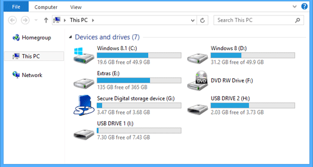

## 20. Choosing an Operating System 
We have learned what computers are made of, so let's move on to how to use a real one. In this section I will give you a quick overview of the operating systems and compare major operating systems that are currently available to help you decide which one is best for you.

In order to interact with your computer, you'll use software called an "operating system". Essentially, an OS is a program that stands between your computer and anything else you run on it. Among its essential functions are file management, memory management, process management, input-output management, and peripheral device control. Nowadays, a program can only concern itself with executing its core functions and let the operating system handle all basic system functionality.

Windows, MacOS, Linux and ChromeOS are four of the most popular operating systems used on desktops, laptops and chromebooks today.

### The usage share of operating systems 
For desktop and laptop computers, Windows is the most used at 69%, followed by Apple's macOS at 21%, Linux-based operating systems at 7% and ChromeOS at about 4%.

Linux has completely dominated the supercomputer field since 2017, with all of the top 500 most powerful supercomputers in the world running Linux.

Let's briefly review each of them individually and then look at some differences between these operating systems in terms of their design, features, and user interfaces.

#### Windows
Windows is just the default OS for most people. It's the first one they get to know and it allows the user to easily run daily tasks such as internet browsing, gaming, office work. Windows is a private piece of software, meaning its source code isn't publicly available. Only Microsoft has access to it. At first, users had to pay if they wanted to buy a copy of Windows OS or upgrade their Windows version.  But with their latest releases users can access most of the software functionalities for free and only need to pay to access some particular features. Another thing to keep in mind is that Windows shows advertisements within the operating system. So it can be thought as an advertising platform as well.

#### MAC OS.
MacOS is built on top of a UNIX-like OS, which is why it shares many common characteristics with Linux. Unlike Microsoft, whose idea is to make the product as widely available and easy to get to as possible, Apple aims to make their products top quality but pricey and incompatible with other hardware. You can't run any software you want in their hardware, and you can't install their software anywhere else than a Mac machine.

## 21. Choosing an Operating System 
#### Linux
Linux is the base of many open-source operating systems. Unlike Windows and MAC OS, Linux isn't a single full operating system, but a collection of programs, utilities and a kernel. 

What is a kernel? The kernel is the core component of the operating system. It's the piece of software that interacts the closest with the hardware and has complete control over all processes in the system. The Kernel is responsible for low-level tasks such as disk management, memory management, task management, and so on.

When you install Linux you have to choose from one of the available disributions. But what is a Linux distibution and why there are many Linux distributions?

Overall, the Linux project has a huge amount of open source code developed by different communities. When Linux was originally developed distributions did not exist. So developers would download the kernel from kernel.org they'd use various complicated tools to compile it, install it on a system, then compile the individual pieces of software downloaded from FTP sites of various software development communities and assemble this all by hand. This was difficult to do. The developers realized that it would be very helpful to provide a distribution of tools that users can use to quickly setup Linux systems. It turned out there was not going to be just one distribution because there were many different use cases and people wanted different sets of tools for various purposes. So this day many different Linux distributions exist each with its own goal and criteria for selecting software included with the operating system.

Some of the Linux distributions are known to be the most secure and stable OSs out there. They're used in key spheres such as banking, finance, government, and military.

As I mentioned above, Linux runs on most servers. It's used on most supercomputers and also on most cellphones (Android is based on Linux kernel).

On the desktop/laptop side of things, Linux usage isn't nearly as widespread. Back in the day, the learning curve necessary to use Linux was considerably higher than for the other two OS options. This situation has been changing lately. Linux distributions put more focus on user-friendliness and it becomes easier to get computers with Linux installed by default.

### 22. The most widely used Linux distributions
There are three families of Linux distributions: RedHat, Debian and openSUSE. Linux distributions share the same operating system and software at their core. It is the package management systems and tools that make the biggest difference between the distributions. The package management system is composed of two components: a low level tool for installing individual packages and a front end tool for performing more complex actions such as updating the operating system, installing groups of packages, and satisfying dependencies.

The lifetime of support is an important consideration when choosing a distribution. It is possible to try out the latest technologies and software with cutting edge distributions like Fedora, but the support time is short (13 months for Fedora). If you do your work on a computer, it is more practical to use a distribution offering a long support period, such as Ubuntu LTS - 5 years or Rocky Linux - 10 years.

---> Skip the rest 
#### RedHat-based Linux distributions.
- [Red Hat Enterprise Linux](https://distrowatch.com/table.php?distribution=redhat). A distribution developed for the commercial market. The source code is open, but binary distribution is commercial. Focused on efficiency, security, and stability. 

- [Fedora](https://distrowatch.com/table.php?distribution=fedora). More user focused than Red Hat. Focused on innovation, integrating new technologies early. It is considered to be on the leading edge of open-source technologies. Short life cycle. It servers as a testing environment for RHEL.

- [CentOS Stream](https://distrowatch.com/table.php?distribution=centos). Positioned as a midstream between Fedora Linux and RHEL. 

- [Rocky Linux](https://distrowatch.com/table.php?distribution=rocky) and [AlmaLinux OS](https://distrowatch.com/table.php?distribution=alma). A complete binary-compatible distros using the RHEL operating system source code. Since both operating systems are built from RHEL source code, there aren't many differences in compatibility, supported architecture, or purpose. The main differences lie in the project funding, which is based on different sponsors, and security.

Red Hat Package Manager (rpm). Front end is yum or its successor dnf. 

#### Debian - based Linux distributions
- [Debian OS](https://distrowatch.com/table.php?distribution=debian) is one of the most stable distros around, 
- [Ubuntu](https://distrowatch.com/table.php?distribution=ubuntu). Ubuntu is the most popular Debian-based desktop Linux distributions. The Long-Term Support (LTS) versions are supported for five years.
- [Linux Mint](https://distrowatch.com/table.php?distribution=mint). Community-driven Linux distribution based on Ubuntu and compatible with Ubuntu repositories. Software that Linux mint develops for its users includes a desktop manager and a number of tools.

Debian Package Management System (dpkg). Front end is Advanced Package Tool (apt)

#### openSUSE
- [openSUSE](https://distrowatch.com/table.php?distribution=opensuse). Offers a choice between standard and rolling releases. What is a rolling release? It receives continuous updates to keep the distribution fresh and upgraded. However, rolling releases are less stable and harder to maintain.
The special feature of OpenSUSE is the wide range of configuration and management options available through YaST (Yet Another Setup Tool). Using the tool without being familiar with Linux can lead to a lot of problems.  So I would not recommend openSUSE to inexperienced users.

Red Hat Package Manager, Front end is  zypper.

## 23. Choosing an Operating System
### Chrome OS
And the last OS we will look at is ChromeOS. The ChromeOS operating system is a specialized operating system developed by Google exclusively for Chromebooks. Unlike traditional operating systems ChromeOS heavily relies on cloud-based services. The ChromeOS operating system was initially limited to apps that could run inside the Chrome web browser. Over the years ChromeOS has evolved into a modern and versatile operating system. Besides supporting all Chrome-based stuff, ChromeOS can also connect to the Play Store and install almost any Android app. Linux applications can now be run on some Chromebook models as well. It is even possible to run Windows applications on high-end Chromebooks (using commercial software such as Crossover and Parallels).

### 24. OS comparison: filesystems.
#### File Systems.
Let's compare operating systems more closely.
Unlike MacOS and Linux, Windows organizes files differently. Windows uses "drives".

Linux and Mac share a similar file system derived from UNIX. In these operating systems, there are no drives - everything is a file, and all files are arranged in directories that descend from a root directory. An organized directory structure is essentially a tree with a unique root.

While it doesn't make much of a difference to the end user, it's something to keep in mind if you're used to navigating one type of file system.

## 25. OS comparison: command shells.
#### Command-Line Shells.
Linux and macOS fall into the family of Unix-like systems that are designed as multitasking, multi-user operating systems. Furthermore, these systems are POSIX-compliant. The POSIX standard establishes compatibility between operating systems. As a result, all these systems offer standard UNIX facilities, and you can interact with them using the same commands.

Using commands is very useful for automation of repetitive tasks, such as backing up files and running batches of data processing. Typically, you'll use a terminal to enter commands. A command-line interface to a Unix-like operating system is called a shell. It works as an interpreter by accepting user input, executing a command based on it, and displaying its output after the command has completed.

Both Linux and Mac have bash or zsh as their default shells, while Windows has its own shell that uses a different syntax (Command Prompt and Powershell). Learning Bash is probably the best option, since this knowledge can be applied to most operating systems. Especially taking into account that Linux runs on most HPC clusters and you'd need to use the terminal to interact with these powerful computers. 

[Bash tutorial](https://swcarpentry.github.io/shell-novice/)

### 26. OS comparison: package managers, software.
#### What is Software package and What is package manager?
Software packages are collections of executable files, libraries, and other required resources bundled together with instructions for installation and configuration.

Packages are pieces of software that contain everything you need to use them in a single archive. 

Package manager is a software service installed atop of the operating system that that helps you to manage other software. Package managers download, install, and maintain various software packages as well as system packages (kernels, drivers, and utilities).    

A package manager keeps track of what software is installed on your computer, and allows you to easily install new software, upgrade software to newer versions, or remove software that you previously installed. Package managers are super helpful, especially when you're installing and uninstalling things constantly. It's much more efficient to install programs through package managers than manually. 

Package managers are the backbone of Linux distributions, so Linux always comes with a package manager by default.

There are two file formats for Linux packages: DEB and RPM. Various Linux distributions use different formats. RPM is the package format for RedHat-based Linux family and openSUSE. DEB is the package format for Debian-based distributions.   

APT is the package manager for DEB packages while RPM packages are managed by yum or its successor dnf.

[APT tutorial](https://itsfoss.com/apt-command-guide/)  
[DNF tutorial](https://docs.fedoraproject.org/en-US/quick-docs/dnf/)

MacOS doesn't come with a default package manager. The most popular package manager for macOS is [homebrew](https://brew.sh). 

Starting from Windows 10 Microsoft provides `App Installer` package manager.  One of the most popular third party package managers available for Windows is [Chocolatey](https://chocolatey.org).

#### Using apt
We'll take a quick look at one of the Linux package managers, apt.  I'll demonstrate several common commands for inspecting packages, installing and managing them.

Linux distributions have precompiled software packages, and when you install Linux apt knows what distribution version you are using and which repository to use. There are some software vendors who maintain their own repositories, and their websites will have instructions on how to add them.

`apt --help`

Lists the most common commands. I'll run a couple of commands to show you how it works .. 
How do you find out what packages are available? 

`apt list | wc -l`

This command lists all available packages, as you might have guessed
You can list only installed packages:

`apt list --installed | wc -l`

When trying to install a program, you might not know the exact name of the package. Say we want to install openmm. 

`apt list openmm`  

- shows nothing

We can search for a package for a keyword anywhere in its description

`apt search openmm`

- finds more packages than you need

Only show packages whose names contain openmm

`apt list | grep openmm`

And at last let's install the image editing program GIMP. Run the command and it's done

`sudo apt install gimp`

GIMP is a very useful open source image manipulation program BTW. Available for all platforms.  I've used GIMP for everything I've needed to do with figures for publication. It is great for things like cropping images, combining them, adding text, and drawing lines and shapes. 

All package managers function in a similar way, but there are differences in the syntax used for each. It's also important to mention that you can install and run a different package manager than the default.

#### Software compatibility
Windows is the most widely used OS, and thanks to that most software is adapted to it. Even though less popular, MacOS is similar to Windows in this regard.

Back in the day, Linux wasn't compatible with many programs out there, but this has started to change recently, especially with the most popular distros like Ubuntu.

### 27. Security and stability, virtual machines
Some GNU/Linux distros are considered the most secure and stable ones nowadays. The fact that the code is available to everyone isn't a security threat as you may think at first – but rather it's an advantage. Bugs can be identified and worked on quicker, and when a security breach is identified lots of people can work on it and propose fixes.

Windows, on the other hand, is considered the least secure and stable of the three. Given that it's the most popular OS, most malware is developed to attack Windows OS too.

#### Windows Registry
A feature that sets Windows apart from other operating systems is its registry. The Windows registry is a database that contains all application settings. This is often referred to as a 'single point of failure' - a part of a system that, if it fails, will stop the entire system from working. Registry is susceptible to corruption from viruses, faulty hard drives, or even improper application uninstallation. Because it is a single global database, it affects the entire operating system. As you install applications, the registry grows and registry searches take longer, slowing down your computer as a result. As you remove applications, pointers to deleted files often remain in the registry, slowing down your computer.

#### Which OS is the "best"?
The operating system doesn't matter much for most people these days. There is no such thing as the "best" OS, so you're better off using the one you're most comfortable with. Even so, each OS is still unique. There are some scientific applications that aren't available on all platforms, and some that don't work well on all operating systems. You may be in a situation where it's a good idea to use several OSes at the same time. For example, you may use Linux working on HPC clusters coding and Windows for Office applications.

#### Exploring OS in a virtual machine 
Using a virtual machine may be a good option if you are undecided between different operating systems or want to try another OS. Having a quick way to install specific Linux distributions for testing code and debugging software problems is very useful to me. For those preparing to work on HPC clusters, it is a good way to get familiar with Linux commands. VirtualBox lets you run multiple operating systems simultaneously on the same machine. While most open source GUI programs are now available for all platforms, there is a great deal of community-developed software on Github for scientific and engineering problems that only runs on Linux.

I will quickly demonstrate how to install an operating system using VirtualBox and use it.

The great thing about VB is that virtualized operating systems are isolated from the host. In this way, you do not have to worry about messing up your computer. The guest operating system is kept in its own folder, which can be deleted if you no longer need it.

Here's how to install Ubuntu.  
`New`  
`Folder` - change the location   
`ISO Image`- select .iso image  
`Unattended install`- create user  
`Hardware` - change memory and the number of CPUs  
`Hard Disk` - size of storage for the system  
`Finish`   

I have already installed Debian and Fedora Linux, as you can see. Now let's start Debian and run a few lines of Python code in it.

It is important to note, however, that the virtualized OS is slower than the native.

### WSL - get the best of two systems 
Windows Subsystem for Linux lets you run Linux directly on Windows, without the overhead of traditional virtual machines. With the latest release of WSL2, even Linux GUI applications can now be run on Windows in a fully integrated desktop environment. You can now install Ubuntu on Windows with one command: `wsl –install`

The bottom line is that whatever operating system you choose is fine as long as it allows you to do what you want.

### Useful Links.
#### [VirtualBox](https://www.virtualbox.org) 
VirtualBox is a powerful virtualization solution. VirtualBox runs on Windows, Linux, macOS, and Solaris hosts and supports a large number of guest operating systems
#### [WSL](https://learn.microsoft.com/en-us/windows/wsl/install)

