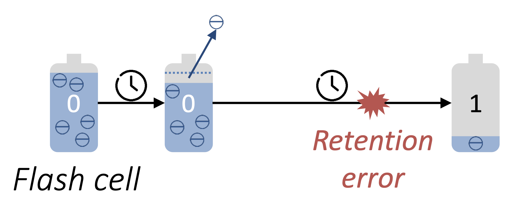
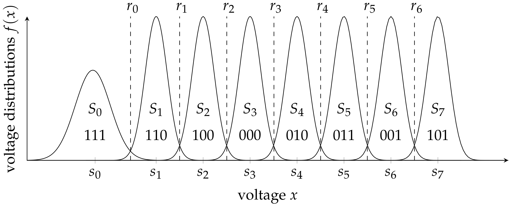
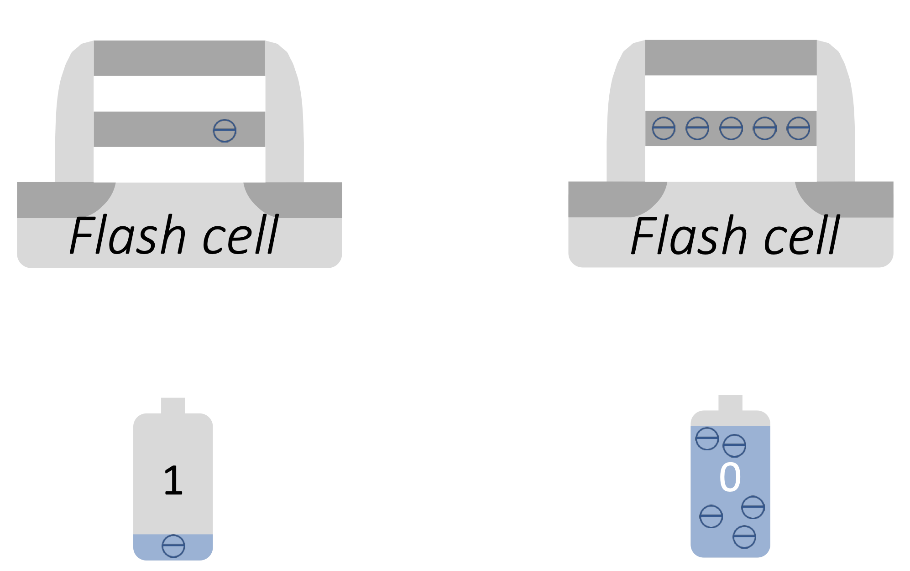

Today's session will cover some basic computer topics. We will learn
- what computers are made off 
- how they work 
- how to use them
- how to maintain them and
- how to handle possible issues

Discuss IO Ports: USB3, USB4, Thunderbolt3
USB 3.2 gen 1: 10 Gb/s, 1 GB/s
USB 3.2 gen 2: 20 Gb/s, 2.422 GB/s
Thunderbolt3:  40 Gb/s  (can be 20 Gb/s on PC)
USB4 v.1:      20-40 Gb/s (optional 40 Gb/s)
USB4 v.2:      80 Gb/s
Thunderbolt4:  40 Gb/s standard for all platforms

GP GPU, 
RTX cores, Tensor Cores in commercial vs consumer GPUs
Amber22 benchmarks 

## What is the best media for long term data storage?
There is just a tiny, tiny amount of electric charge that keeps your data alive in each data cell, and once the data has been written, that charge is never refreshed, even if you plug the flash drive into a powered computer, or insert a flash media card into a device.

JEDEC JESD218A endurance specification requires a flash memory chip that’s turned off and stored at 25C to retain data for 101 weeks. Not even two years.

You should ideally not own more than about 5–10 flash memory cards, and you should be moving everything off the oldest ones to magnetic hard drives and then reusing them. Do not “archive” on flash media!

Life extension of flash media is possible by “refreshing” the stored charge in the data cells, but I do not know of any utility programs that can do this.

If you were to read the contents of each “sector” of the media and then rewrite the data back into the exact same sector locations, you would renew the charges and give your data in flash media another 5–10 years of life extension.

(A manual route is to copy everything off of a flash card or SSD, format the card/SSD, then copy everything back on it.)

Long term storage of archival data is really something of a problem because there is no good solution for it. Generic writable optical disc media also degrades over time, so burning files to CD-R or DVD-R is not necessarily the best solution either. There are special gold archival CD/DVD media, but it is more expensive than the generic stuff.

Hard drives or tape media (as Mark mentions) are really the only good long-term options. Though, archival hard drives are best stored inside a fully enclosing metal box known as a Faraday cage, and unplugged. A lightning strike can blow up any hard drive with power or data wires running to it.

If you buy a small safe deposit box from a local bank, these are usually solid metal, and kept inside a solid metal safe. This is the best place for personal archival hard drives.

### Flash reliability concerns.
As flash technology continues to scale down and more bits are stored in a cell, the raw reliability of memory cells decreases substantially. 

According to the JEDEC standard JESD47G.01, NAND Flash blocks cycled to 10% of the maximum specified endurance must retain data for 10 years, and blocks cycled to 100% of the maximum specified endurance have to retain data for 1 year. 

JEDEC Solid State Technology Association. Stress-Test-Driven Qualification of In- tegrated Circuits, JESD47G.01, April 2010. http://www.jedec.org/

- SLC implements single-error-correcting Hamming codes
- MLC (2 bit) needs 24-error-correcting Bose-Chaudhuri-Hocquenghem (BCH) codes
- TLC and QLC require more sophisticated error correction algorithms

### NAND Flash Memory Challenges
- Requires erase before write 
- High raw bit error rate, requires error correction algorithms
- Limited flash memory lifetime (limited number of erase/write cycles)
- Retention loss due to charge leakage ove time

Bits are represented by the charge state of a floating gate transistor.

 The best choice is to use SSD for OS and HDD for storage.

### Common misconceptions about flash storage
- People often believe that flash drives are more reliable than magnetic hard drives because SSDs are solid state drives, they are not prone to mechanical failures like magnetic hard drives.

- As many people are aware of the fact that SSDs have a limited data retention time due to the loss of charge, they tend to think that if SSDs are powered on regularly then they will be automatically recharged.

## What is the best media for long term data storage?

There is just a tiny, tiny amount of electric charge that keeps your data alive in each data cell, and once the data has been written, that charge is never refreshed, even if you plug the flash drive into a powered computer, or insert a flash media card into a device.

And it’s not just solid state drives (SSDs), but also those convenient little flash cards used for cameras, and also USB flash drives. People using “flash card wallets” to “archive” their photos on camera flash media are all going to be so upset in about 10–15 years after they wrote that data, as their image files become unreadable and their precious photos have disappeared.

JEDEC JESD218A endurance specification requires a flash memory chip that’s turned off and stored at 25C to retain data for 101 weeks. Not even two years.

You should ideally not own more than about 5–10 flash memory cards, and you should be moving everything off the oldest ones to magnetic hard drives and then reusing them. Do not “archive” on flash media!

Life extension of flash media is possible by “refreshing” the stored charge in the data cells, but I do not know of any utility programs that can do this.

If you were to read the contents of each “sector” of the media and then rewrite the data back into the exact same sector locations, you would renew the charges and give your data in flash media another 5–10 years of life extension.

Though flash media tends to store data in larger blocks than a 256-byte or 4096-byte sector, so this refreshing would involve reading a full data block, then erasing and rewriting back to the exact same data block.

(A manual route is to copy everything off of a flash card or SSD, format the card/SSD, then copy everything back on it.)

Long term storage of archival data is really something of a problem because there is no good solution for it. Generic writable optical disc media also degrades over time, so burning files to CD-R or DVD-R is not necessarily the best solution either. There are special gold archival CD/DVD media, but it is more expensive than the generic stuff.

Hard drives or tape media (as Mark mentions) are really the only good long-term options. Though, archival hard drives are best stored inside a fully enclosing metal box known as a Faraday cage, and unplugged. A lightning strike can blow up any hard drive with power or data wires running to it.

If you buy a small safe deposit box from a local bank, these are usually solid metal, and kept inside a solid metal safe. This is the best place for personal archival hard drives.

Misconceptions about flash storage
- Many people think that storing data on flash is more reliable than magnetic HDD because SSD are "solid state drives"
- Many people are aware of the limited data retention time due to charge loss, but they think that if SSD's are regularly powered on they will be automatically "recharged".

As NAND Flash technology continues to scale down and more bits are stored in a cell, the raw reliability of NAND Flash decreases substantially. 

JEDEC Solid State Technology Association. Stress-Test-Driven Qualification of In- tegrated Circuits, JESD47G.01, April 2010. http://www.jedec.org/

- SLC implements single-error-correcting Hamming codes
- MLC (2 bit) needs 24-error-correcting Bose-Chaudhuri-Hocquenghem (BCH) codes
- TLC and QLC require more sophisticated error correction algorithms

### NAND Flash Memory Challenges
- Requires erase before write 
- High raw bit error rate, requires error correction algorithms
- Limited flash memory lifetime (limited number of erase/write cycles)
- Retention loss due to charge leakage ove time

Bits are represented by the charge state of a floating gate transistor.

#### Package managers
Mac and GNU/Linux come with package managers installed by default. A package manager is a piece of software that allows you to install, update, and uninstall programs from the terminal, just by entering a few commands.

They're super helpful, especially when you're installing and uninstalling things constantly, as it's much more efficient to install programs through package managers than manually.

Mac's package managers are called (HomeBrew, MacPorts). Not installed by default. [HomeBrew](https://brew.sh) is the most widely used package manager.

On GNU/Linux, the default package manager depends on the distro. For example, Ubuntu comes with APT, Arch comes with Pacman, and so on.

All package managers function in a similar way, but there are some differences in the syntax used for each. It's also important to mention that you can install and run a different package manager than the default.

Windows Package Manager winget command-line tool is bundled with Windows 11 and modern versions of Windows 10 by default as the App Installer.

Chocolatey

## 25. What is electronic computer?

In the computer, there are many millions of nanoscale electronic switches called transistors capable of flipping on and off billions of times each second. Except for a busted switch, a switch can be on or off, closed or open. When a switch is "on" or "closed", an electrical signal passes through it, while when it is "off" or "open," that signal is blocked. In computer science a switch that is "on" is represented by a 1 and a switch that is "off" is represented by a 0. 

## 26. Why do computers use binary numbers

Computers use binary code inside the central processing unit (CPU) and RAM because this is the easiest and simplest way to record and process the electrical currents that run through their hardware. Representation of data in 1s and 0s reflects how computers are organized internally. By representing data in a way that matches how an actual computer works, scientists enabled computers to carry out data processing and instructions processing with the same components. With this way of organizing the computer and the data it processes, we are now able to achieve incredible computational performance and storage capacities.

[ Binary number system is positional numeral system employing 2 as the base and so requiring only two different symbols for its digits, 0 and 1, instead of the usual 10 different symbols needed in the decimal system. ]

Another reason why we use binary system is binary logic. Boolean algebra defines operators for manipulating manipulating combinations of True and False values.  True and False sounds similar to 1 and 0, or on and off. Thus it is no surprise that boolean algebra is a foundation of digital circuit design. 

If you stack transistor switches together, you create a logic gate with two inputs. The gate compares two different input states (for example if each of the switches is on or off) to determine its output. Therefore, there are three main types of gates and three different logical operations available in computing: AND, OR, and NOT. This is how computers make decisions and is the basic principle of computer programming. A program is made up of logical sets of instructions. An example of how this works in real life might be: “If I push the button on the front door or I push the button on the garage door the doorbell will ring". 

## 27. TRUE and FALSE (Boolean Logic)
Let's have a quick look at Basic Boolean Operations.
A very useful tool when working with boolean logic is the truth table.

AND: the result is T if, and only if, all inputs are T; if any input is F, the result is F.
OR: the result is T if any inputs are T; the result is F if, and only if, all inputs are F.
NOT: the result is T if the input is F, and F if the input is T.

These basic operations can be combined in any number of ways to build, literally, everything else in a computer. With logic gates, we can create circuits for data storage and for mathematical operations such as addition, multiplication, division, etc.

One neat thing about Boolean Logic is that it converts directly into electronic circuitry.
We used True (T) and False (F) to indicate logic states. When we talk about actual circuits, it's more typical to talk about high (H) and low (L) signals. Computers become “faster” by getting switches that can go from H to L faster.

## 29. Everything in computers is digits.

In computers numbers encode both commands and data. Everything on a computer is represented as streams of binary numbers. Audio, images and characters all look like binary numbers in machine code. These numbers are encoded in different data formats to give them meaning, eg the 8-bit pattern 01000001 could mean the number 65, the character 'A', or a color in an image.

## 30. Pointers
Pointers provide a very efficient access to variables stored in memory and are used in many programming languages. A pointer tells you where something is, like an address or a phone number and many other things that you encounter every day. However pointers and pointer arithmetic are a leading factor of confusion for many new, and even experienced programmers. 

I'll try to explain as simple as possible what are pointers. Suppose the computer is a community, every data stored in the computer is a house, and every smallest unit of memory is a person in the house, and your friend happens to live in this community. Now you come to this community to visit friend. You want to find his house, so you check his address. It points to the location of your friends house, and you find this house according to address.

Thus pointers are variables that store the addresses of other variables. In other words, pointer points to a variable that is stored at a given address. 

## 31. So why don’t I need to enter numbers?

Since everything in the computer is a number, why it doesn't require me to enter any numbers?
You don’t enter in billions of numbers because people have built operating systems. An operating system is the most important software that runs on a computer. It manages the computer's memory and processes, as well as all of its software and hardware. It also allows you to communicate with the computer without knowing how to speak the computer's language. Without an operating system, a computer is useless.

In early days of electronic computers (1955–65) there was no operating system. A programmer would first write the program on paper in FORTRAN or assembler, then punch it on cards. He would then bring the card deck down to the input room and hand it to one of the operators and go drink coffee until the output was ready.

When the computer finished whatever job it was currently running, an operator would go over to the printer and tear off the output and carry it over to the output room, so that the programmer could collect it later. Then he would take one of the card decks that had been brought from the input room and read it in. If the FORTRAN compiler was needed, the operator would have to get it from a file cabinet and read it in. 

Much computer time was wasted while operators were walking around the machine room. People quickly looked for ways to reduce the wasted time. The solution was the batch system. The idea behind it was to collect a tray full of jobs in the input room and then read them onto a magnetic tape. Thus the first operating system was born and a long way (almost a century) of OS development began.     

## First digital computer
~~~
The first digital computer was designed by the English mathematician Charles Babbage who died 1871. He never got his 'analytical engine' working properly because it was purely mechanical, and the technology could not produce the required wheels, gears, and cogs to the high precision that he needed. And of course the analytical engine did not have an operating system.

Interestingly, Babbage realized that he would need software for his 'analytical engine', so he hired Ada Lovelace, who was the daughter of the British poet Lord Byron, as the world's first programmer. The programming language Ada® is named after her.
~~~

### Polls:
#### 1.
What is the number of charge levels in a quad level cell?
1. 4
2. 8
3. 12
4. 16

